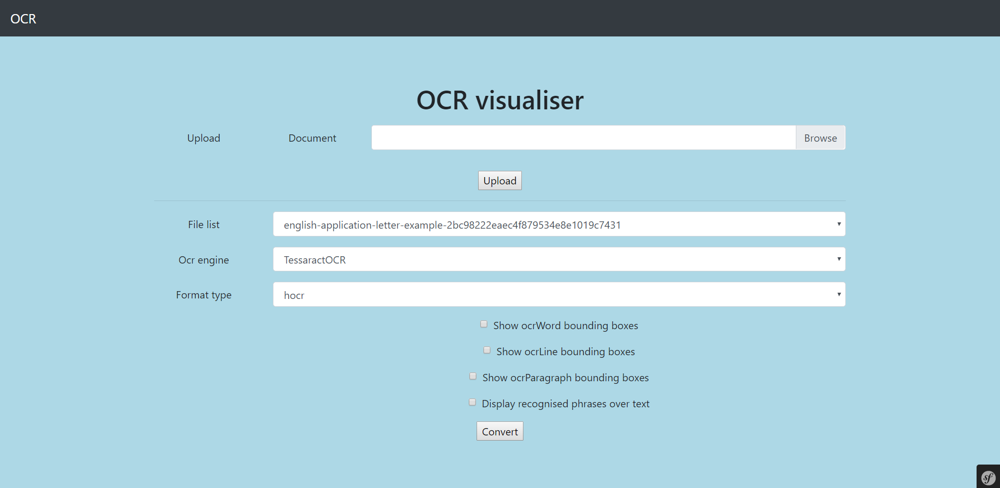
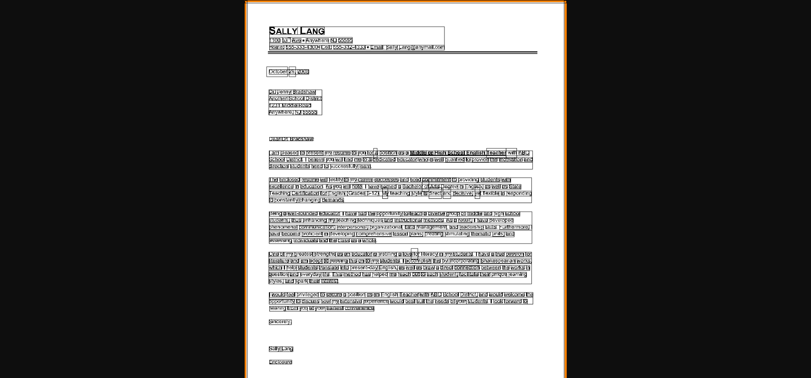
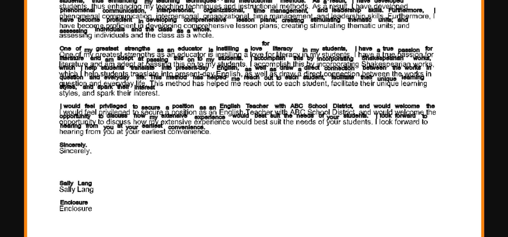

## Table of contents
* [General info](#general-info)
* [Requirements](#requirements)
* [Technologies](#technologies)
* [Features](#features)
* [Installation](#installation)
* [Screenshots](#screenshots)

## General info
Appliation which aims to visualise how OCR work (using tessaract OCR library).

## Requirements
* PHP imagick module
	
## Technologies
Project is created with:
* Symfony 4
* Imagick
* PHPHtmlParser - https://github.com/paquettg/php-html-parser

## Features
* Displaying tessaractOCR bouding boxes on image (words, lines, paragraphs)
* Displaying recognised phrases over text on image

## Installation
#### Clone the repository
#### Run composer
```
composer install
```
##### Create database
```
 php bin/console doctrine:database:create
```
#### Run migrations
```
php bin/console doctrine:migrations:migrate
```

## Screenshots

### Homepage

### Image with all bounding boxes

### Part of the image with recognised text

